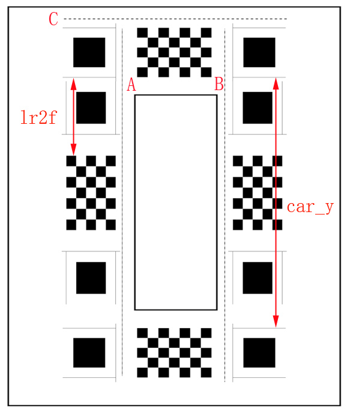
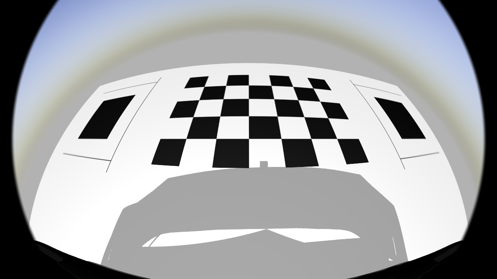
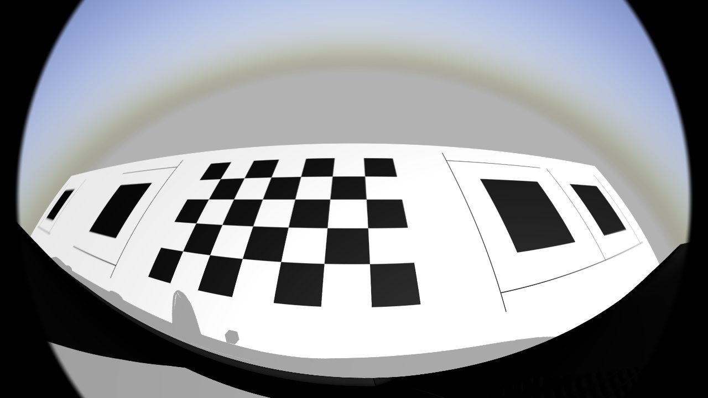
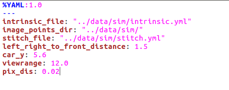
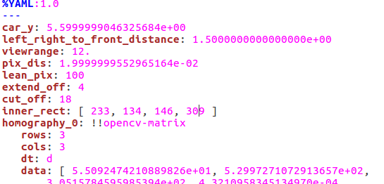
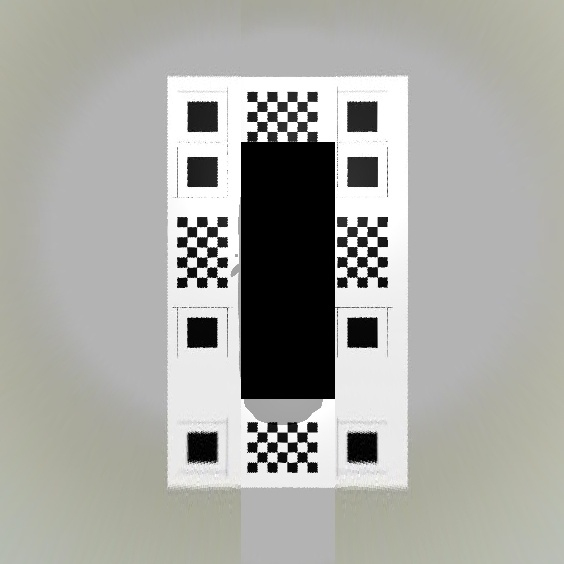
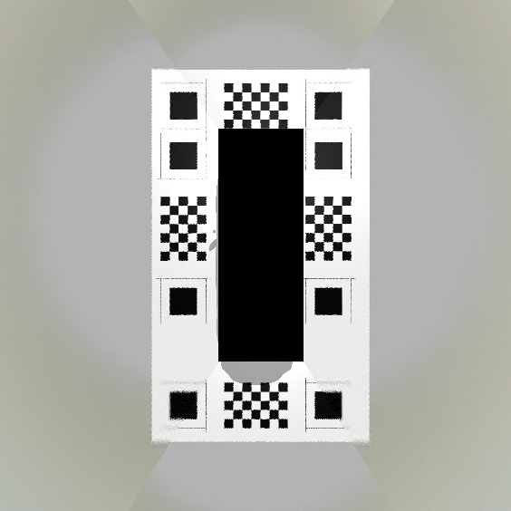
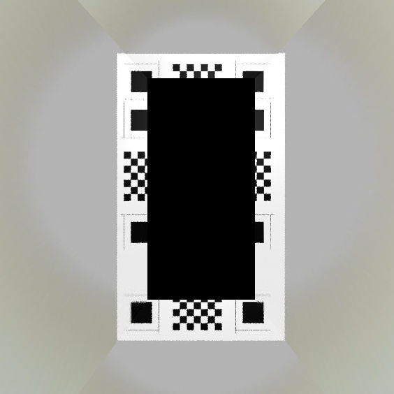

# 环视配置

## TODO LIST
1. 内参误差评测标准除了重投影误差之外，还需要引入重投影可用的fov限定。在fov较大区域，重投影误差大，容易出现问题。
2. 自动选点失败情况，加载自动选点位置，通过鼠标选点ok之后，再进行标定操作
3. 优化debug信息，给出重投影误差，理论点与实际点比对的中间结果，便于排查误差点
4. 自动评测最终的拼接图尺度信息，给出理论的拼接尺度误差信息


## 一、内参标定

**TODO!**


## 二、外参标定

### 1. 标定流程

标定工具：标定布x4，透明胶带，激光水平仪，固定相机工具（胶水，扳手等），8米量程卷尺，u盘。

1. 将车辆停在标定场地（最小6mx8m）中央，要求标定场地地面平整。
2. 清理标定场地，确保地面干净、无砂粒，标定布可以贴合地面。
3. 启动原始图预览，打开rviz，将标定布按照俯视图样部署在车的四周，**要求长边的两条线对齐（采用激光水平仪对准直角、直线, A与B垂直于C，A与B侧边标定布线段成一条直线），标定布平整贴合地面，标定布无翘边（边缘处采用透明胶带贴合），各相机观察区域与样图类似。**
4. 启动采集环境，采集4张原始图，确保标定布范围内无反光，成像清晰。
5. 测量标定布部署尺寸，lr2f(left_right_to_front_distance),car_y两个尺寸。
6. 将采集到图像和测量的尺寸拷贝到u盘。

标定布部署效果参考，车辆停在中间空白区域，确保每个相机看到各自那侧的所有标定内容



各相机看到标定布内容如下图所示
===
**前视相机**


===
**右视相机**


===
**后视相机**


===
**左视相机**




2. 外参处理流程

下载处理流程（ggmap分支）：git@gitlab.momenta.works:sanming/sw_stitch.git


依赖环境：Linux、Opencv-3.3.1、ceres、gflags

编译： 

```
mkdir build
cd build
cmake ..
make -j4
```

执行流程
1. 准备内参校正文件intrinsic.yml
2. 编辑校正文件calib.yml，修改相关路径与外参标定的参数
3. 将外参标定图片拷贝到image_points_dir所在目录下，命名为front.jpg、right.jpg、back.jpg、left.jpg
4. 查找到的外参标定点，在build目录下执行 ../bin/x86_64/testFindPoints --calib_file calib.yml
5. 进行外参校正，在build目录下执行 ../bin/x86_64/testCalib --calib_file calib.yml
6. 执行拼接，在build目录下执行 ../bin/x86_64/testStitch --calib_file calib.yml


示例，中间结果将输出在image_points_dir目录下：
```
../bin/x86_64/testFindPoints --calib_file ../config/sim/calib.yml
../bin/x86_64/testCalib --calib_file ../config/sim/calib.yml
../bin/x86_64/testStitch --config_dir ../config/sim/

```

外参标定文件内容如下图所示：



**修改stitch.yml中的参数，可以改变最终输出的拼接图样式**


1. lean_pix, 表示接缝从竖直往外偏移的像素个数
2. inner_rect，表示中心黑框大小

输出效果如下:
===
**lean_pix为0**



===
**lean_pix为100**



===
**lean_pix为100, inner_rect改大**


