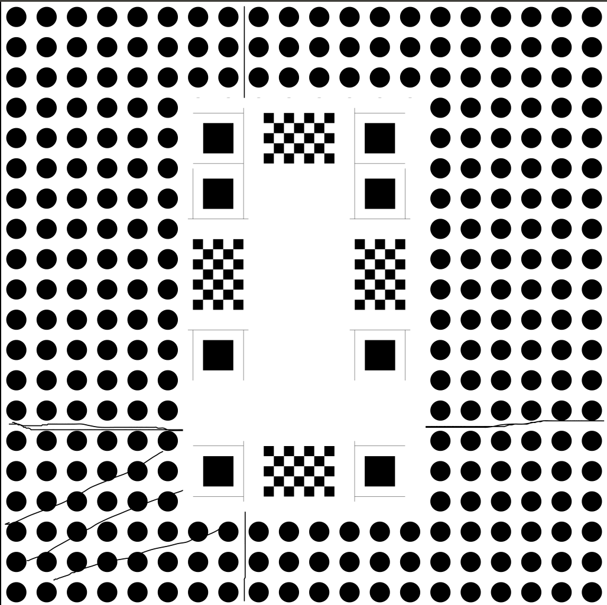

# 识别circle+生成pics
这个是个比较简单的生成circle俯视图和识别circle的demo
## 生成路径
在config的circle目录下
## 命令解释
```
../bin/x86_64/testFindCircle 1 16 20 1-16
```
1. 1 16 代表生成4*4circle左上坐标
2. 20 代表生成半径20cm的circle
3. 1-16是读取**原图**的名字（默认1-16-l.jpg是左视图，1-16-b.jpg是后视图，pic放在config/circle中读取）【可以改】


===